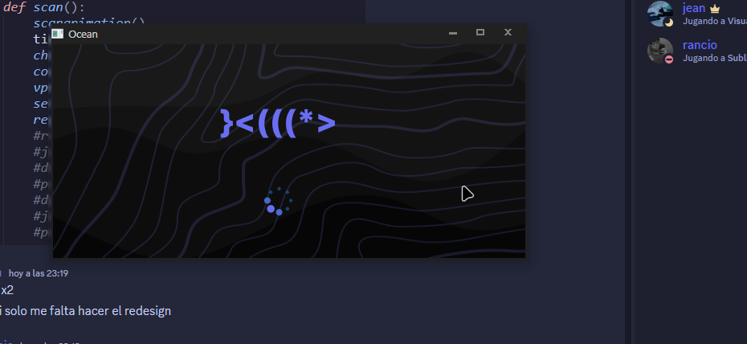
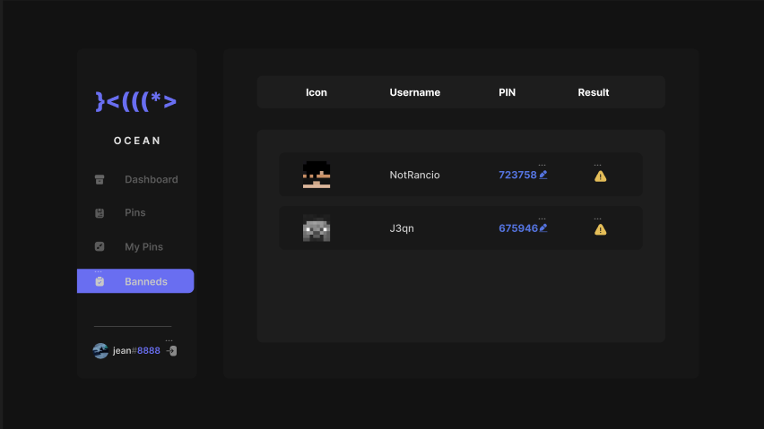
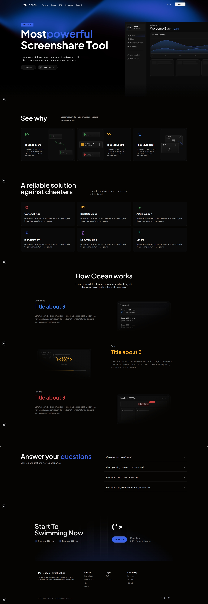
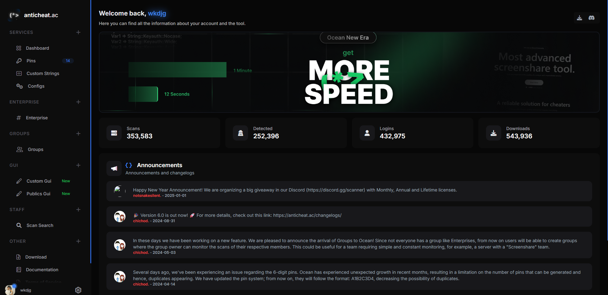

Ocean is a ScreenShare tool launched on April 4, 2023.    

It began as a leisure project by three friends. It started as a free Minecraft-based ScreenShare Tool, made in Flask, Python, HTML, Tailwind, and Sqlite.    

The ScreenShare Tool became very popular and began to grow rapidly, expanding to games such as Minecraft Bedrock, Rust, and its main game, GTA V (FiveM).    

Currently, Ocean is one of the most important tools for protecting gaming servers for various games. It has thousands of detections, hundreds of clients, and constant updates.      

My work at Ocean initially began as a full-stack developer. At first, I developed the dashboard (using the aforementioned technologies) and the front-end. Currently, my work at Ocean is more focused on the front-end and product design using technologies such as Figma, React/Astro, Next.js, and Tailwind, developing landing pages, blogs, and dashboards.

    
