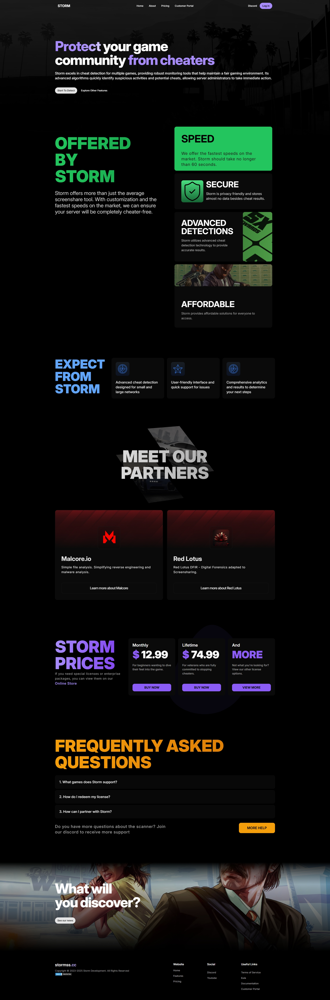

StormSS is a tool for ScreenShare based mainly on FiveM (Gta V).
    

I was hired as a freelancer for this project, and my job was to do the frontend and a little bit of the backend. The technologies I used for the landing page were Astro, Tailwindcss, and React components.
  
