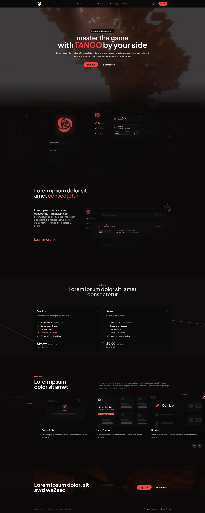
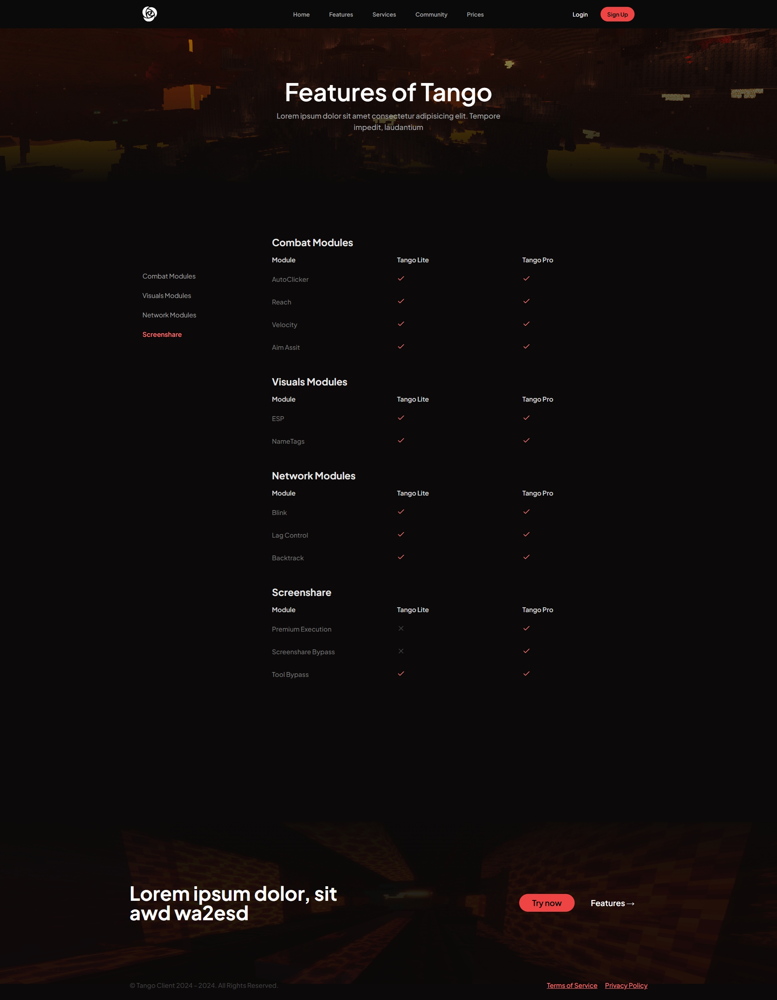
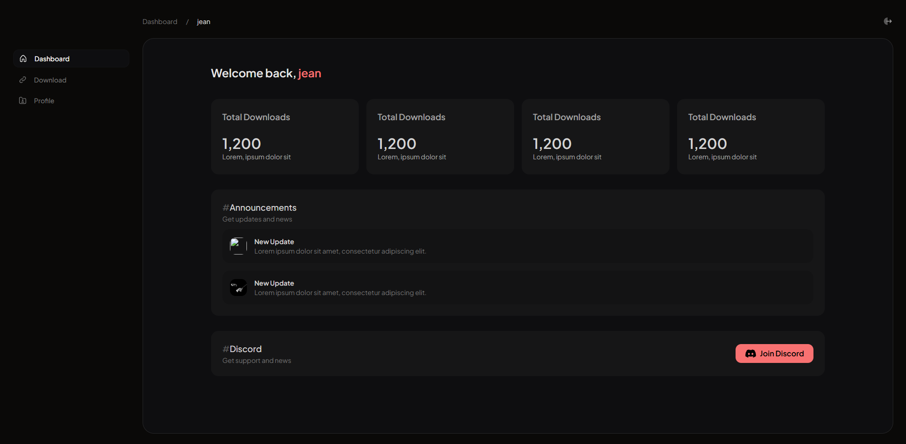

Tango is a Hack Client made for Minecraft 1.8.9 compatible with different Launchers and clients.    

I was hired as a freelancer for this project, and my job was to create the entire website (Landing, Dashboard, and alternate pages).
    
In this project, I used Astro, Tailwindcss, and React components for the frontend.
    
I also used Flask (Python) and SQLite for the backend.

Images: 

    

    
